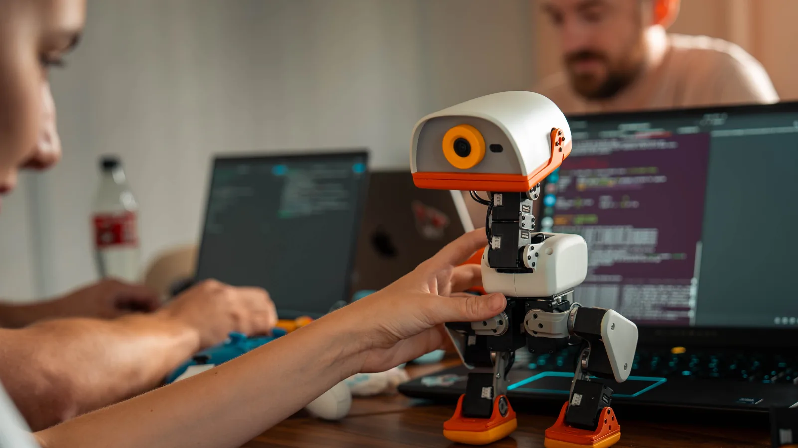
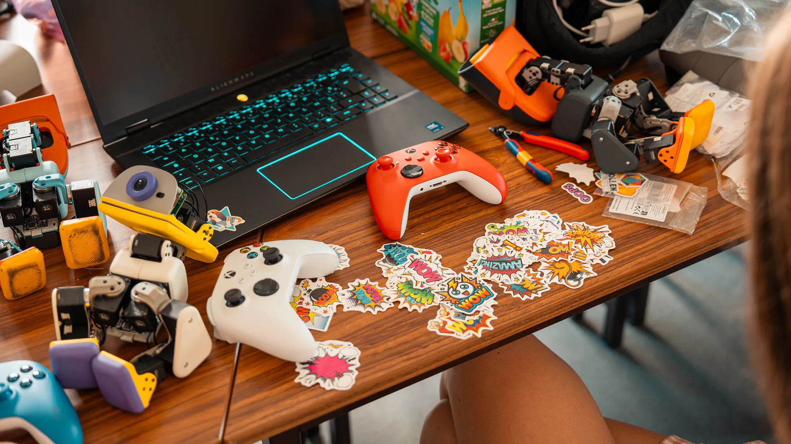
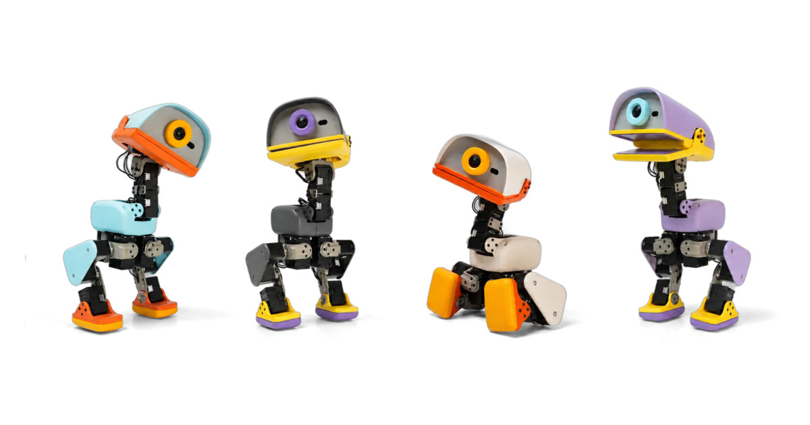
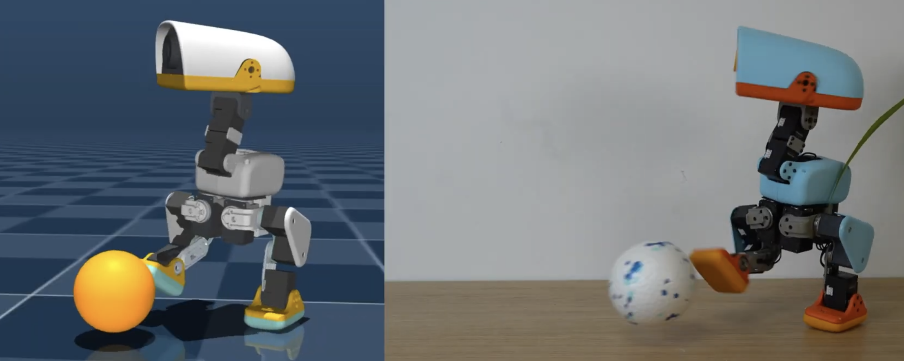

import Callout from '../../components/Callout.astro';
import DaemonArchitectureSimulator from '../../components/microduck/DaemonArchitectureSimulator';
import BamDynamicsVisualizer from '../../components/microduck/BamDynamicsVisualizer';
import PolicySandbox61D from '../../components/microduck/PolicySandbox61D';
import WasmSimulatorEmbed from '../../components/microduck/WasmSimulatorEmbed';

2026 年 8 月 27 日，Hugging Face 旗下的机器人团队 Pollen Robotics 突然上线了一款名为 Microduck 的微型双足机器人。

高度 25 厘米，重量不到 800 克，拥有 15 个电机自由度，早鸟预售价定在极其激进的 **399 美元**。在开放预订的短短 6 个小时内，销售额突破 100 万美元；24 小时内，订单总金额冲破了 **260 万美元**（按基础售价折算约 6,500 台机器人）。

初看之下，亮黄色的喙、憨态可掬的鸭步与可爱的外形，很容易让人把它归类为面向极客或儿童的高阶智能玩具。但当你顺着它的开源代码仓库一层层往下扒，会发现事情绝非这么简单。

<Callout type="tip" title="核心技术洞见">
Microduck 的本质，是 Hugging Face 试图把在开源语言模型和多模态领域验证成功的「Hub 飞轮」，完整复刻到物理具身智能（Physical AI）领域的一次工程探险。
</Callout>

Pollen Robotics 创始人 Matthieu Lapeyre 给出的定位极其明确：**Reachy Mini 是与 AI 互动的平台，而 Microduck 是 AI 行动的平台**。

它不再要求开发者购买动辄上万美元的昂贵机械狗或全尺寸人形机器人，而是通过将全套软件栈开源（Apache 2.0），打通了一条从 MuJoCo GPU 物理仿真、BAM 执行器建模、ONNX 端侧量化部署、到 50Hz 嵌入式 Linux 闭环运行的极简技术链路。

*官方实拍：单手手持高度约 25 厘米、重量不到 800 克的 Microduck。来源：pollen-robotics.com*

---

## 机械透视：25cm 躯体内如何塞进 15 个自由度？

要理解 Microduck 的运动能力，首先必须拆解它的动力学骨架。微型双足机器人的核心瓶颈在于：尺寸越小，结构谐振频率越高，关节对传动误差和齿轮旷量越敏感。

通过下方的官方实拍和文字拆解，先建立真实机械结构的尺度感。后面的交互组件会分别展示系统架构、执行器动力学和策略观测空间。

### 1. 关节拓扑与动力链分布

Microduck 全身由 14 台 Robotis Dynamixel XL330 智能串行总线伺服，加上喙部的 1 台微型电机组成，共计 15 个自由度：

- **双腿关节链（10 DOF）**：左右腿各 5 个自由度，依次配置为髋偏航（hip_yaw）、髋横滚（hip_roll）、髋俯仰（hip_pitch）、膝俯仰（knee）和踝俯仰（ankle）。这种 5-DOF 构型舍弃了双足人形机器人常见的踝部被动横滚自由度，将左右重心转移的重任完全交给髋部 roll 关节与鸭掌边缘的自然圆角弧度，极大降低了下肢末端惯量。
- **头部视线链（4 DOF）**：包括颈部俯仰（neck_pitch）、头部俯仰（head_pitch）、头部偏航（head_yaw）与头部横滚（head_roll）。结合前置摄像头与 8×8 ToF 深度传感器，它能独立完成三维视线反向运动学（Gaze IK），在躯干剧烈摇摆行走时保持镜头稳定。
- **抓取喙部（1 DOF）**：位于头部前方的可活动嘴部（jaw），配合内置的近场 NFC 天线，能低头触地舀起物体，完成地面轻小物体的抓取与转运。

*开发工作台实拍：Microduck 研发桌台，配有 Xbox 手柄、NP-F550 电池、贴纸与调试工具。来源：Pollen Robotics*

### 2. 计算、传感与电气系统

- **核心算力**：采用瑞芯微 Rockchip RK3566 单板计算机（4 核 ARM Cortex-A55 @ 1.6GHz，搭配 Mali-G52 GPU 与 0.8 TOPS NPU），板载 1GB LPDDR4 内存与 32GB eMMC 存储。
- **环境感知**：头部集成一片 8×8 区域的 Time-of-Flight（ToF）激光测距雷达（VL53L5 系列），以 15Hz 频率持续广播 64 点深度场；前置摄像头搭配专用硬件 REC 状态指示灯，确保视觉采集满足家庭隐私伦理。
- **双 IMU 协同**：身体躯干与头部各布置一片高频惯性测量单元（IMU）。身体 IMU 负责向控制策略喂入 3 维投影重力向量（Projected Gravity），一旦偏离标准站立基准超过阈值，立即触发跌倒判定。
- **动力电池**：没有采用定制异形锂电池，而是采用了摄影圈极其普及的索尼 Sony NP-F550 标准相机电池（2600 mAh）。虽然单次续航约在 1 小时左右，但用户可以廉价购入多块备用电池实现秒级热拔插。

<Callout type="important" title="必须厘清的开源法律边界">
注意：Microduck 是「开源软件平台」，而不是「开源硬件产品」。官方开源了包括 SDK、Daemon 守护进程、MuJoCo 仿真环境和全部强化学习策略在内的完整软件栈（Apache 2.0 协议）；但机械 CAD 图纸、模具注塑数据与 PCB 硬件电路均为商业闭源。你无法免费下载图纸 3D 打印一台合法的整机。
</Callout>

---

*官方实拍：Microduck 的 4 款量产配色——奶油白 (Cream)、石墨灰 (Graphite)、薰衣草紫 (Lavender) 与天空蓝 (Sky)。来源：Pollen Robotics Press Kit*

## 软件架构：7 个守护进程如何做到「死机不砖」？

在传统具身智能原型机中，很多团队习惯写一个巨大的 Python 单体脚本，把传感器读取、神经网络推理和串口通信混在一起。一旦相机推流阻塞或者神经策略抛出异常，整个机器人便彻底失控，甚至导致电机过载烧毁。

Microduck 彻底摒弃了这种脆弱的单体思路。它在 Linux 用户空间设计了一套由 **7 个独立 Rust 守护进程构成的分布式服务总线**，进程间统一采用基于 Unix 域套接字（UDS）的 NDJSON-RPC 2.0 协议。

你可以通过下方的进程拓扑控制台，亲手注入系统故障，观察整机的容错响应机制：

  
7-DAEMON 进程拓扑与故障注入控制台 · IPC FAULT INJECTOR模拟进程崩溃、失衡与更新

  <DaemonArchitectureSimulator client:visible />

### 1. 三层容错分工：把控制与恢复彻底解耦

这套架构最精妙的工程决策，在于确立了**恢复路径（Recovery Path）不依赖控制核心（robotd）**的不变量：

1. **控制核心（`robotd`）**：单线程独占总线控制循环，每秒执行 50 次严格的 20ms 硬实时节拍，负责串口读写、运动学解算与安全层策略。
2. **恢复路径（`configd` / `updaterd` / `btd`）**：这三个服务在系统启动时独立挂载。即使 `robotd` 因为策略计算溢出或者串口短路发生死锁崩溃，`updaterd` 和 `configd` 依然毫发无损。用户依然可以通过低功耗蓝牙（BLE）连上机器人，查看系统日志、修改 Wi-Fi 配置，或者下发固件回滚指令。
3. **外围传输与传感（`mediad` / `padd` / `tofd`）**：流媒体推流、手柄输入和 ToF 深度检测均为无状态客户端。相机崩溃不会波及电机，手柄断连会自动触发死区停车。

### 2. 为什么选择 Unix Socket + NDJSON，而非 D-Bus 或 gRPC？

官方架构文档（architecture.md）详细记录了通信协议的技术选型权衡：

- **文件系统权限即免费鉴权**：Unix 域套接字可以直接通过 Linux 文件系统的 `0660` 权限与用户组实现隔离，远比开放本地 TCP 端口（可能因为配置失误绑定到 `0.0.0.0` 导致外网入侵）安全得多。
- **`SO_PEERCRED` 审计追踪**：服务端每次收到 RPC 请求时，内核会自动提供调用者的 UID/GID，区分只读观察者（如监控面板）与有损修改者（如固件刷写）。
- **极小依赖链**：采用纯 Rust `tokio` + `LinesCodec` 实现的 JSON-RPC 仅引入 30 个依赖库，而 gRPC（81 个依赖）和 D-Bus `zbus`（66 个依赖）过于臃肿，且 D-Bus 类型系统无法直接穿透到浏览器端 WebRTC 数据通道。

### 3. 三道安全防线与「形状门」拦截

为了防止未经验证的第三方 AI 策略造成物理破坏，`robotd` 内置了物理层无法穿透的安全层（Safety Layer）：

- **物理总线唯一写句柄**：除了 `robotd`，板内任何其他进程（包括 root 权限的 Python 脚本）都严禁向 `/dev/ttyS2` 发送写入指令。
- **跌倒失软（Fall-to-Limp）**：身体 IMU 实时解算重力投影。一旦倾角大于 42°，安全层在当前 tick 立即关断全部伺服力矩，机器人顺势软倒在地，避免齿轮暴力扫齿。
- **输入输出形状门（Shape Gate）**：任何外来 ONNX 策略在加载内存前，必须经过静态维度校验。输入必须严格等同于 `[1, 61]`，输出必须严格等同于 `[1, 14]`。若维度不符，策略直接被拒，控制权强制回退至预设的保持站姿（Hold Pose）。

---

## 突破 Sim-to-Real 鸿沟：为什么必须引入 BAM 电压物理？

在强化学习物理仿真领域，绝大多数开源机器人项目都折戟在同一道关卡上：在虚拟模拟器里学得健步如飞的策略，一旦烧录进真实硬件，机器人要么剧烈高频抖动，要么双腿发软直接瘫倒在地上。这就是著名的**仿真-现实鸿沟（Sim-to-Real Gap）**。

传统的物理仿真器（如早期的 Isaac Gym 或原生 MuJoCo）通常把机器人关节抽象为**理想 PD 控制器**：假设电机接收到目标角度指令后，能够产生无限瞬时力矩，且电机刚度与阻尼是恒定不变的理想线性参数。

但在真实世界里，驱动 Microduck 的是一台仅重 18 克的微型舵机。在下方动力学波形对比器中，你可以拖动电压跌落与摩擦滑块，观察真实物理与理想模拟的巨大背离：

  
BAM 执行器动力学与电压物理模拟 · ACTUATOR PHYSICS调节母线电压、摩擦因数与齿轮旷量

  <BamDynamicsVisualizer client:visible />

*官方 microduck_rl 仓库头图：左侧 MuJoCo Warp GPU 仿真环境与右侧物理实体机器人并列。来源：pollen-robotics/microduck_rl*

### 1. 真实微型伺服的四大物理陷阱

Pollen 团队在 `microduck_rl` 仓库中深刻总结了导致小尺寸机器人 Sim-to-Real 失败的真实根源：

1. **母线电压下垂（Battery Voltage Sag）**：NP-F550 电池在充满电时为 8.4V，中度放电为 7.4V，重载大电流深蹲或快速抬腿时，母线瞬时电压可能急剧下跌至 6.6V。电压下跌 20%，电机电枢产生的最大电磁转矩将同比例骤降超过 25%。传统 PD 策略完全没有考虑电压波动，电机出力不足直接导致步态失衡。
2. **反电动势削弱（Back-EMF）**：当关节以高角速度快速摆腿时，内部直流无刷电枢会产生与供电电压反向的感应电动势，有效驱动电压被严重削减，电机的净可用力矩随转速急剧衰减。
3. **非线性摩擦（Coulomb & Stribeck Friction）**：微型塑料齿轮箱在低速启动瞬间存在巨大的静摩擦死区（Stiction）。微小误差信号根本无法驱动齿轮转动；而一旦突破静摩擦阈值，动摩擦力又会瞬间骤降。
4. **齿轮箱反向间隙（Backlash）**：塑料齿轮在咬合面之间天然存在约 ±1.0° 的物理旷量。由于主轴磁编码器安装在传动链输出端，在力矩换向的极短时间内，电机会出现空转漂移。

### 2. BAM（Bilateral Actuation Model）的工程破解

为了抹平这一鸿沟，Microduck 团队联合波尔多大学 Rhoban 实验室，直接在 MuJoCo Warp 动力学求解器内植入了 **BAM 驱动器物理模型**（`FrictionDRBamActuator`）：

- **电压控制律建模**：仿真器不再向关节下发抽象的力矩数值，而是根据真实的电机电阻、电感常数 $K_t$、$K_e$ 计算反电动势与实时电枢电流。
- **域随机化（Domain Randomization）**：在并行训练的数千个虚拟环境中，人为给电池电压注入随机抖动（如 6.8V 到 8.4V 浮动），给摩擦系数注入 0.5× 到 2.0× 的随机扰动。模型在训练阶段就必须学会「哪怕当前电池快没电了，也能依靠惯性稳住身位」。
- **Backlash 虚拟铰链映射**：通过自动脚本 `add_backlash.py`，在每个主动驱动关节后方串联一个无驱动的被动间隙铰链 `passive_<joint>_backlash`。仿真器在反向解算时能够精准模拟出那 ±1° 的迟滞回线，使得神经网络输出的高频指令天然带有阻尼平滑特性。

---

## 策略生态：61 维统一观测如何实现零重启热插拔？

很多具身智能框架在训练不同技能时，往往为每个任务设计定制化的特征向量。比如走路任务需要线速度指令，踢球任务需要球体三维坐标，视觉导航任务又需要点云特征。这种做法的后果是：**机器人在切换技能时必须重启整个推理上下文**。

Microduck 确立了一套硬性工程标准：**所有出厂与社区训练的强化学习策略，必须强制锁定在同一个 61 维观测张量契约之内**。

在下方策略控制台里，你可以点击切换不同技能，并拨动虚拟摇杆查看这 61 个浮点数值在内存中的实时映射分布：

  
61D 统一观测张量与策略热插拔控制台 · POLICY HOT-SWAP COCKPIT切换 8 大主流策略与手柄输入

  <PolicySandbox61D client:visible />

### 1. 61 维特征切片明细

这 61 维紧凑特征全部来自端侧直接采集的低延迟物理量，无需经过昂贵的神经网络特征提取：

| 索引范围 | 物理维度 | 含义与信号源 |
| :--- | :--- | :--- |
| `0 .. 2` | 3 维 | 身体 IMU 三轴角速度陀螺仪读数 $\omega_x, \omega_y, \omega_z$ |
| `3 .. 5` | 3 维 | 身体姿态归一化重力投影向量 $g_x, g_y, g_z$（标准站立为 $[0, 0, -1]$） |
| `6 .. 19` | 14 维 | 14 个主动伺服关节当前的实时编码器弧度位置 $q_{pos}$ |
| `20 .. 33` | 14 维 | 14 个主动伺服关节当前的实时角速度 $q_{vel}$ |
| `34 .. 47` | 14 维 | 上一个 50Hz 周期策略网络输出的动作目标历史 $a_{t-1}$（提供阻尼记忆） |
| `48 .. 50` | 3 维 | 操作员下发的基础移动指令 twist（前后线速度 $v_x$、横移速度 $v_y$、自转角速度 $\omega_{yaw}$） |
| `51 .. 54` | 4 维 | 头部姿态控制指令 head_pose（俯仰角、偏航角、横滚角等） |
| `55 .. 60` | 6 维 | 躯干期望姿态修剪指令 body_pose（重心高度调整、俯仰偏置等） |

*实机演示：加装被动双轮附件后，双足小鸭子化身旱冰滑手，在户外以最高 0.6 m/s 巡航。来源：Pollen Robotics*

### 2. 零开销热插拔的底层逻辑

正是因为观测空间（61D）与动作空间（14D）在所有任务中被彻底冻结：

- 当你按下手柄的 `A` 键触发「喙部地面拾取（GroundPick）」时；
- 或者是长按十字键上 3 秒从「双足步行」切换为「四轮滑旱冰（Roller）」时；

`robotd` 的主线程不需要重新分配任何系统内存，也不需要触发垃圾回收。它只需在当前 20ms 的 tick 边界处，将指向 `walk.onnx` 的 ONNX Runtime 会话指针原子重定向至 `ground_pick.onnx`。

在下一个 50Hz 周期到来时，新的策略网络无缝吃下这 61 维统一观测，立刻吐出适应新姿态的 14 维关节目标位置。整个切换过程在 20 毫秒内一气呵成，机器人不会发生丝毫掉电抽搐或姿态塌陷。

---

## 浏览器端实操：纯 WebAssembly 物理模拟沙盒（在线开鸭）

如果你手头暂时没有这台 399 美元的物理实体机，Hugging Face 官方还提供了一份**完全运行在浏览器内存里的纯 WebAssembly 物理模拟沙盒**。

无需配置 Python 环境，无需本地英伟达独立显卡，直接在下方交互窗口中点击即可启动。支持使用键盘 `W / A / S / D` 驾驶移动、按 `M` 键瞬时切换双足 ⇄ 旱冰滑板模组、按 `Q / E` 踢球，甚至支持插入 USB 游戏手柄直接操控：

  
MICRODUCK 3D 物理模拟沙盒 · WEBASSEMBLY & ONNX-WEB支持键盘 WASD 与手柄直接操控

  <WasmSimulatorEmbed client:visible />

---

## 终局推演：Hugging Face 能把机器人变成模型市集吗？

拆解完 Microduck 的全部技术底牌，我们可以看清 Hugging Face 这步棋的深远意图。

在过去十年中，具身智能行业始终困在一条封闭的死胡同里：波士顿动力（Boston Dynamics）拥有全球最顶尖的动力学控制，但其代码体系高度私有；各大高校和实验室各自采购小批量科研硬件，软件栈千奇百怪，论文中的 RL 步态代码通常在换了一台电机后就彻底无法复现。

Microduck 正在尝试推翻这堵墙：

1. **硬件标准化与极限制造成本**：用 399 美元的量产硬件把进入门槛拉入大众开发者区间，让全球成千上万名没有专业机器人实验室的 AI 研究员，能在真实物理实体上验证自己的 Sim-to-Real 算法。
2. **构建物理策略的 GitHub（Model Channel 路线图）**：在规划中的 **M8 里程碑**中，Pollen 团队将正式打通策略与 Hub 的连线。未来的开发者只需一条命令 `robotctl update apply model-walk-swizzle`，就能像在电脑上执行 `pip install` 一样，直接从 Hugging Face Hub 上拉取全世界同行训练好的各种奇异步态或动作策略。

### 潜在挑战与现实冷思考

但我们必须同时保持清醒的技术克制。Microduck 的未来依然横亘着数道严苛的现实考量：

- **产能与交付考验**：首日 260 万美元的狂热订单迅速将交付周期推迟至 4 到 6 个月。硬件量产涉及电机良率、齿轮磨损、注塑公差与跨国供应链物流，这对于一家由科研团队转型的初创公司是极具挑战的考验。
- **生态活跃度假设**：预订机器人的 6500 名买家里，究竟有多少人真正具备使用 CUDA / MuJoCo 训练并贡献开源策略的能力？如果最终大部分买家只是用手柄把它当成玩具操控两周便搁置吃灰，那么策略 Hub 的网络效应便无从谈起。
- **第三方模型的物理安全性**：虽然「形状门」与「跌倒保护」提供了底层兜底，但当数以千计未经专业测试的第三方策略涌入 Hub，如何防范恶意构造的激振频率导致微型齿轮箱在几分钟内剧烈共振打齿，依然是平台治理必须直面的技术课题。

无论最终成败几何，Microduck 已经为我们展示了一种令人兴奋的全新可能：**当双足机器人不再是高高在上的百万级科研仪器，当物理实体的行动策略可以像一段开源文本模型一样被全球开发者协同微调、分支 Fork 与一键分发时，物理具身智能的「ChatGPT 时刻」或许才会真正拉开序幕。**

---

## 参考来源与公开技术资料

1. Pollen Robotics 官方发布公告 *Meet Microduck*（2026-08-27）：[pollen-robotics.com/microduck/blog/introducing-microduck](https://pollen-robotics.com/microduck/blog/introducing-microduck/)
2. Microduck 官方媒体资源与规格表（Press Kit）：[pollen-robotics.com/microduck/press-kit](https://pollen-robotics.com/microduck/press-kit/)
3. Microduck 主运行时与控制总线源码仓库：[github.com/pollen-robotics/microduck](https://github.com/pollen-robotics/microduck)
4. Microduck 强化学习环境与 MuJoCo Warp 训练仓库：[github.com/pollen-robotics/microduck_rl](https://github.com/pollen-robotics/microduck_rl)
5. Microduck 浏览器端纯 WebAssembly 物理模拟沙盒：[huggingface.co/spaces/pollen-robotics/microduck-simulator](https://huggingface.co/spaces/pollen-robotics/microduck-simulator)
6. Microduck 守护进程与 IPC 设计架构文档（architecture.md）：[github.com/pollen-robotics/microduck/blob/main/docs/design/architecture.md](https://github.com/pollen-robotics/microduck/blob/main/docs/design/architecture.md)
7. Microduck 50Hz 控制循环与安全层规范（robotd-design.md）：[github.com/pollen-robotics/microduck/blob/main/docs/design/robotd-design.md](https://github.com/pollen-robotics/microduck/blob/main/docs/design/robotd-design.md)
8. Rhoban 实验室 BAM 执行器物理建模技术文献：[github.com/Rhoban/bam](https://github.com/Rhoban/bam)
9. mjlab 强化学习框架：[github.com/mujocolab/mjlab](https://github.com/mujocolab/mjlab)
