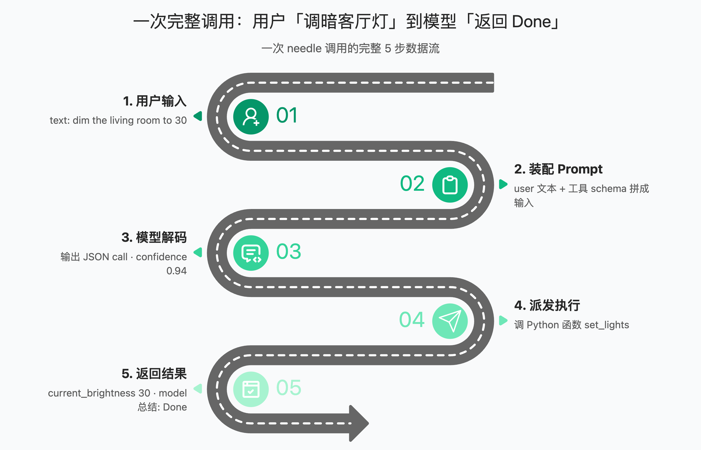
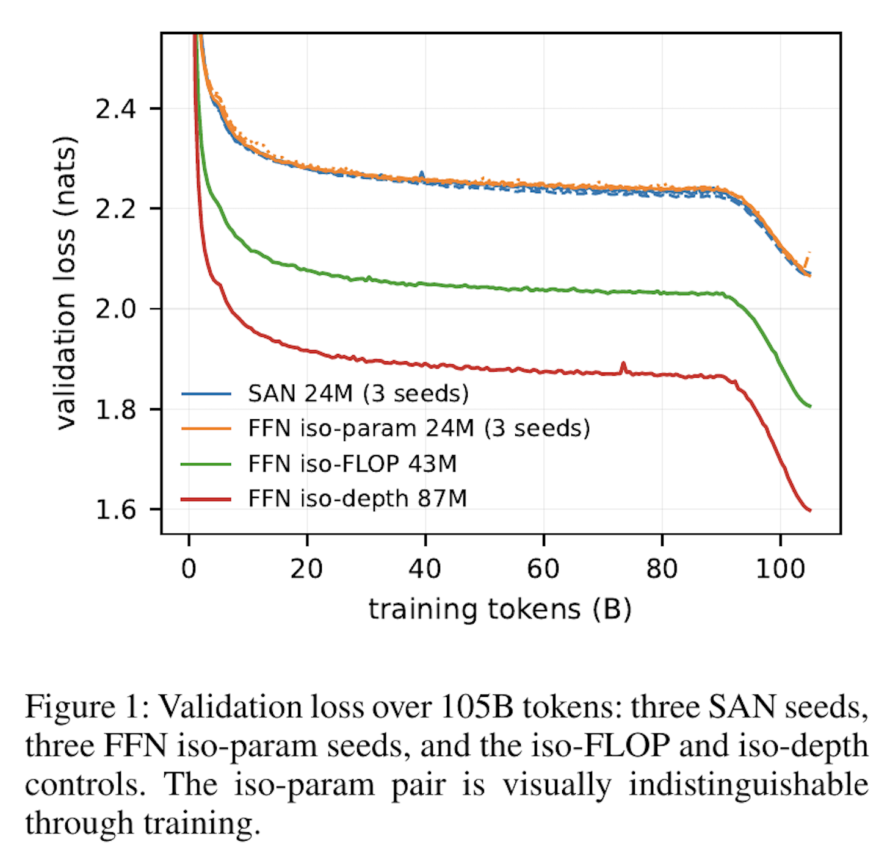
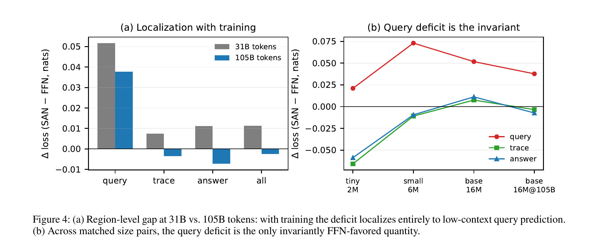
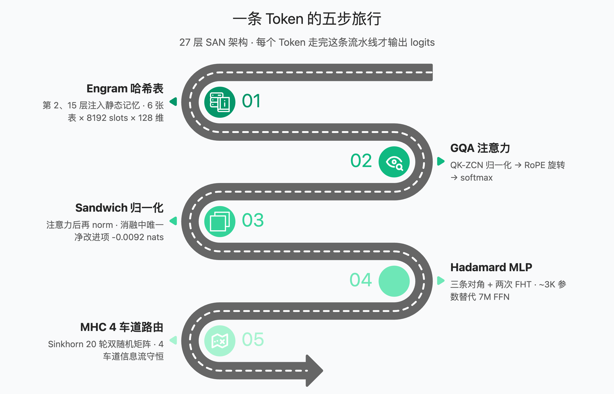
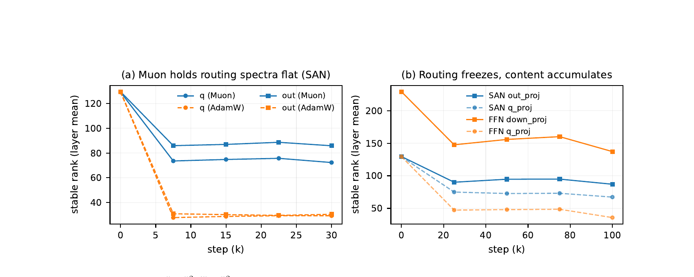

import Callout from '../../components/Callout.astro';
import Steps from '../../components/Steps.astro';

Needle 2 是 Cactus Compute 开源的端侧基础模型：连权重、推理引擎、分词器算在一起 **14MB**，跑起来占 **28MB** 内存。45M 参数（主 preset `needle`：d=768，12 头 / 6 KV 头，27 层），目标是在手机、手表、音箱上直接执行工具调用。

仓库 [`cactus-compute/needle`](https://github.com/cactus-compute/needle)，MIT 许可。架构论文《A Controlled Study of Attention-Only Transformers》挂在 [arXiv:2607.18363](https://arxiv.org/abs/2607.18363)。

## 为什么值得关注

<Callout type="tip" title="一句话定位">
Needle 2 的统一抽象是：**每个问题都是一个函数调用**。执行动作与抽取结构化数据是同一件事，区别只在于你声明了什么 schema。
</Callout>

它把"听懂一句人话，然后可靠地按对按钮"这件事的成本压到了几乎可以忽略——而可靠性来自一组**可验证的契约**，不是模型"足够聪明"。

| 指标 | 数值 | 说明 |
| --- | --- | --- |
| 参数量 | 45M | d=768，12 Q 头 / 6 KV 头，27 层 |
| 部署体积 | **14MB** | CQ2-bit 量化，烘焙进单一 `.cact` 二进制 |
| 运行内存 | **≈ 28MB** | 256-token 滑窗 + 工具 pinned 为 KV sink，会话任意长都不膨胀 |
| 词表 | 8192 | SentencePiece BPE，含工具调用专用控制 token |
| 推理速度 | prefill 4300 tok/s · decode 850 tok/s | 实测 |

## 三条硬契约

Needle 2 的可靠性不来自"模型足够聪明"，而来自一组可验证的契约：

1. **拒绝免费文本**：没有任何声明工具能服务的请求，返回空调用 `[]`。这是离题输入的全部契约。
2. **参数只取有据之值**：可选字段在输入中没有证据时**省略**，不猜测——省略就是字段级的 `[]`。
3. **JSON 永不变形**：工具名、参数键、参数值由字节级语法（byte-level grammar）约束解码。

<Callout type="important" title="为什么这三点重要">
小模型最容易出丑的两个洞——"硬聊"和"编参数"——被契约焊死。下游只需 `if not calls: escalate()`，永远不用解析幻觉工具名。
</Callout>

## 快速上手

### 安装

```bash title="安装 needle"
pip install cactus-needle
```

首次运行会按平台从 HuggingFace 拉取预编译推理引擎（mac arm64 / mac x86_64 / win amd64 / win arm64 / manylinux / musllinux），解出 `libneedle.*` 缓存到 `~/.cache/cactus-needle/`，之后**全程离线**。

### 声明工具并运行

**装饰器（简单）**

```python title="tools.py"
import needle

@needle.tool
def get_weather(city: str):
    "Get the current weather for a city."
    return {"city": city, "temp_c": 27, "sky": "clear"}

agent = needle.Needle(tools=[get_weather])
print(agent.run("what's it like in Lagos right now?"))
```

**Field 约束（进阶）**

```python title="tools.py"
from typing import Annotated
import needle

@needle.tool
def send_money(
    amount: Annotated[float, needle.Field(gt=0, le=10000, description="USD, up to 10,000")],
    to:     Annotated[str,   needle.Field(pattern=r"^@[a-z0-9_]+$", description="recipient handle")],
    memo:   Annotated[str,   needle.Field(max_length=80)] = "",
):
    "Send money to a handle."
    return {"sent": amount, "to": to}
```

**Pydantic（抽取）**

```python title="extract.py"
from pydantic import BaseModel
import needle

class Invoice(BaseModel):
    vendor: str
    total: float
    due_date: str

invoice = needle.extract("Invoice from Acme Corp, $1,200.00, due 2026-09-01", Invoice)
print(invoice.vendor, invoice.total)   # -> Acme Corp 1200.0
```

### 每轮返回的统一 JSON

```json title="模型输出"
{
  "type": "call",
  "success": true,
  "function_calls": [
    {
      "name": "set_lights",
      "arguments": {"room": "living room", "on": true, "brightness": 30}
    }
  ],
  "reasoning": "'living room' -> room; 'dim' -> on true, brightness 30",
  "confidence": 0.94,
  "prefill_tps": 4300.0,
  "decode_tps": 850.0
}
```

## 置信度：失败模式设计成"升级"而不是"错执行"

置信度是两个信号的**最小值**：

```text
Confidence = min ( 校准头预测概率 , 解码 Token 概率积 )
```

1. **校准头（ConfidenceHead）**：训练出来的二分类头，对"完整 prompt + 模型刚产出的调用"打分——事后看完整动作。
2. **解码概率积**：调用 token 序列在采样时的累积生成概率——边看边算。

<Callout type="warning" title="产品契约">
只有两个信号一致，调用才算数。自定一个阈值：≥ 阈值直接执行，< 阈值重问用户或路由到更大的模型。**失败模式被设计成升级（escalation），不是错误执行**——needle 不会瞎执行一个错的。
</Callout>

## 字节级语法约束解码

常规做法是在 prompt 里请求模型"请只输出合法 JSON"——那是**请求，不是保证**。Needle 2 把保证移到解码器：每一步采样前，把所有会让输出脱离文法的 token 的 logit 置 $-\infty$。模型可以在合法集合内自由发挥，但**永远跨不出边界**。

```text
你的声明（函数签名 / Pydantic / JSON Schema / Field 约束）
       │  tools.py 编译
       ▼
  JSON Schema（name + parameters + required + 约束）
       │  引擎侧编译（C++）
       ▼
 byte-level grammar ──► 约束每个 decode step 允许的下一个字节
```

### 约束清单

`Field` 支持将以下规则精准编译进字节语法：

| 类别 | 约束 |
| --- | --- |
| 结构 | `enum` / `const` / `required` |
| 数值 | `minimum` / `maximum` / `exclusiveMinimum` / `exclusiveMaximum` / `multipleOf` |
| 字符串 | `minLength` / `maxLength` / `pattern` / `format` |
| 数组 | `minItems` / `maxItems` / `uniqueItems` |

<Callout type="note" title="字节级 vs token 级">
文法在**字节层面**定义，与具体分词器无关——任何 token 只要其字节前缀仍可能落在合法串内就允许。这让 `pattern`（正则）、`ge/le`（数值区间）、`max_length` 能精确编译。README 原话："the model can only ever emit values that satisfy them"——约束不是事后校验，是**生成时不可违抗**。
</Callout>

### Reasoning 与 JSON 的分界

| 区段 | 约束状态 | 理由 |
| --- | --- | --- |
| `<think>` 推理过程 | **自由生成** | 给人看的推导，保持可读 |
| `<tool_call>` 工具名与键 | **死锁约束** | 字典序固定，不可能幻觉出未声明的键 |
| `<tool_call>` 参数值 | **规则约束** | 类型/区间/枚举/正则全锁 |
| 空调用 `[]` | **合法输出** | 离题请求的唯一出路 |

### 大工具目录：Top-5 动态子集文法

声明工具 > 5 时，ContrastiveHead 检索头介入：

1. init 时把每个工具 schema 嵌入为向量（缓存到 `tool_index_path`）；
2. 每轮把 query 嵌入，只有得分最高的 5 个工具进入上下文；
3. **解码文法实时在 Top-5 子集上重建**——未选中的工具**不可达，而不只是低概率**。

## 运行时 5 步完整数据流

以"把客厅灯调暗到 30"为例，`run()` 循环：



渲染模板：

```text title="render_example"
<|im_start|>user
&lt;tools&gt;{schemas}&lt;/tools&gt;
{query}<|im_end|>
```

<Steps>

### 装配 Prompt

工具 schema、上一轮结果、当前 query 按渲染模板拼起来。

### 模型解码

在 byte-level grammar 下逐 token 生成调用，confidence 同步累计。

### 派发执行

从 JSON 里读 `name` 和 `arguments`，调你的 Python 函数。

### 结果回填

把函数返回值 JSON 化，作为下一轮的输入。

### 判定终止

返回 `type: "respond"` 结束；返回 `type: "call"` 继续派发；返回 `[]` 拒绝。`run()` 默认最多 8 步防死循环。

</Steps>

<Callout type="tip" title="错误处理">
模型调了未知工具 → 返回 `{"error": "unknown tool: ..."}` 并继续循环；你的函数抛异常 → 异常字符串作为结果回喂，模型有机会自我修正。
</Callout>

## SAN 架构：模型是怎么做到的

14MB 装下一个能干活的模型，靠的是一篇论文加一堆抠到字节的工程。

### 论文核心问题

Transformer 里占**三分之二非嵌入参数**的 FFN 层，到底是不是必需品？难点是删掉 FFN 会同时改变参数量、计算量和深度——单控任何一个变量都被另外两个污染。解法是三种对照各做一遍：



| 对照组 | 参数量 | GFLOPs/tok | Val loss (nats @105B) | 与 SAN 差距 |
| --- | --- | --- | --- | --- |
| **SAN 纯注意力** | 24.13M | ~0.40 | **2.0685** | 基准 |
| **FFN 同深度** | 87.06M | ~0.72 | **1.5982** | −0.470 |
| **FFN 同算力** | 43.00M | ~0.39 | **1.8059** | −0.263 |
| **FFN 同参数** | 24.12M | ~0.20 | **2.0812** | **+0.0055** |

<Callout type="important" title="核心结论">
同参数下，把省下来的 FFN 参数全换成注意力深度，差距缩到 **0.0055 nats**（总损失的 0.27%）。两个干净种子分别测出 0.0055 / 0.0054，吻合到小数点后四位。**FFN 的参数重要，FFN 的形式不重要。**
</Callout>

### 差距住在哪：低上下文 Query 区



| Token 区域 | 占比 | Δ @31B | Δ @105B |
| --- | --- | --- | --- |
| **Query 低上下文** | 5.8% | +0.052 | **+0.038 赤字区** |
| **Trace 推理段** | 57.2% | +0.008 | −0.004 SAN 反超 |
| **Answer 答案段** | 35.9% | +0.011 | −0.007 SAN 反超 |

注意力模型在推理段和答案段都追平甚至反超，**唯独在低上下文 query 上稳定落后**——那些上下文里没有任何线索、只能靠权重里死记硬背的位置。工具调用恰好是"上下文路由"任务（schema 全在上下文里），**needle 选 SAN 是任务匹配，不是奇迹**。

### 一条 Token 的五步旅行



<Steps>

### Engram 哈希表

第 2、15 层注入静态 n-gram 记忆。FNV 风格哈希（纯整数运算），`orders=(2,3)` × `heads=3` = 6 张表，每张 8192 slots × 128 维。不经过注意力，给底层模式召回提供静态字典。

```text title="Engram 注入"
哈希索引  acc = ( (seed ⊕ u_{t-j}) × FNV_PRIME ) ⊕ (acc ≫ 15) mod 8192
注入系数  α  = σ( RMSUnit(x) · RMSUnit(e_k) / √d )
残差注入  x_new = x + α · e_v
```

### GQA 注意力

QK-ZCN 归一化 → RoPE 旋转 → softmax。12 个 Q 头共享 6 套 K/V，KV cache 直接减半。RoPE 在 QK-Norm **之后**施加：先归一化定向，再旋转定位。

### Sandwich 归一化

注意力输出再做一次 ZCN 归一化（消融中**唯一净改进项**，−0.0092 nats），按住深层堆叠的分布漂移。

### Hadamard MLP

用固定的 Walsh-Hadamard 正交变换替代 FFN 的大矩阵：

```python title="Hadamard MLP"
n = next_pow2(d)            # d=768 → n=1024
H = WalshHadamard(n)/√n     # 固定正交矩阵，n log n 快速变换
z = (d1 * x) @ H            # d1: 可学习对角，init 1
z = silu(d2 * z) @ H        # d2: 可学习对角，init 1
y = (d3 * z)[:d]            # d3: 可学习对角，init 0.02
```

每层参数仅 **3n ≈ 3072**，对比 SwiGLU FFN 的 $3 \times 768 \times 3072 \approx 7.1M$——**三个数量级**的差距。FHT 只用加减、零乘法、零权重读取，对内存带宽极度友好。

### MHC 4 车道路由

残差流设 4 条车道（`mhc_lanes=4`），每层利用 20 轮 Sinkhorn 算法算出双随机矩阵 $P$，确保每条车道信息流守恒，路由不会塌缩到单车道。

</Steps>

### 权重谱动力学（Stable Rank）



1. **路由矩阵（Q/K）**在训练的前 25% 阶段就迅速结晶固化，后续不再变化。
2. **内容写入矩阵**在 SAN 模型中由注意力输出投影 $W_o$ 承担——它是纯注意力模型唯一的残差流写入路径，在整个训练期持续累积奇异值秩。

这解释了删掉 FFN 后内容存储能力为何自动转移到 $W_o$。

## Cactus Quants：45M 参数怎么压进 14MB

### 经典标量量化的痛点

朴素量化按 128 个权重分组取 $\max(|W|)$ 作 scale。一旦组内出现离群值（outlier），整组的有效分辨率就会坍塌。

### CQ 核心算法：先旋转，再量化

```python title="CQ 量化"
rot  = g @ H                  # 1. 正交旋转，能量守恒，抹平离群值
norm = ||rot||₂               # 2. 提取组 L2 范数（fp16 存储）
unit = rot / norm             # 3. 归一化为单位球面向量（近似标准高斯）
idx  = nearest(unit, codebook)# 4. 查 Lloyd-Max 高斯码本索引
```

<Callout type="tip" title="为什么有效">
1. **正交保范数**：$H H^\top = I$，反量化时乘同一个 H 回来。
2. **分布整形**：Hadamard 混合把 outlier 能量摊到全组 128 维，旋转后各分量近似**同分布高斯**——把"任意分布的量化问题"变成"标准高斯的量化问题"。
3. **码本共享**：范数由 fp16 承载，码本只需描述单位球面上的方向，一个预计算的 Lloyd-Max 码本服务所有组。
</Callout>

同一个 H 在 needle 里出现两次：CQ 量化的预旋转，以及 Hadamard MLP 的无权重混合——一次当"分布整形器"，一次当"免费的混合器"。

### Lloyd-Max 码本

对标准正态做 200 轮 Lloyd 迭代（最近邻分配 ↔ 质心更新），收敛到**最小均方失真**的标量量化器。2/3/4 bit 各算一次缓存复用。三值（1.58 bit）用解析质心 `{-c, 0, +c}/√g`（`c = 1.2240064`，`g` 为分组大小），无需迭代。

### 部署数值架构（W4A8 / W2A8）

| 对象 | 精度 | 机制 |
| --- | --- | --- |
| matmul 权重 | CQ 2/3/4 bit | 离线量化打包 |
| norm / Hadamard 对角 / 门 | **FP16** | 小参数不值得压 |
| 激活 | 8 bit（A8） | `fake_quant_act` |
| KV cache | int8（可 2/3/4） | `cq_fake_quant_kv`，组 64 |

## 28MB 端侧推理工程

### 内存账本

| 内存组成 | 占用 | 依据 |
| --- | --- | --- |
| **权重** | ~14.0 MB | `.cact` 文件 mmap 只读映射，不占动态堆 |
| **KV Cache** | ~11.5 MB | 256-token 滑窗 + 工具 Schema Sink 常驻 |
| **激活与缓冲区** | ~2.5 MB | Tensor 临时空间 + 65KB 输出 Buffer |
| **合计** | **~28.0 MB** | 内存上限恒定，与会话轮数无关 |

<Callout type="important" title="关键不是小，而是恒定">
滑窗注意力 `keep[t] = (现在 − t < window) OR sink[t]`。没有 sink，窗口滑过去后模型会"忘记自己能调什么工具"。256-token 滑窗 + 工具 schema 作为 attention sink 常驻 KV，会话无限长内存不涨。**内存不涨，记性也不长**——这是 28MB 承诺的另一面。
</Callout>

### 权重工件设计：mmap 直读，零解析

`.cact` 的格式决策（`export.py` 头注释）：

1. **mmap 或链接为只读段**——加载即内存映射，无解析、无反序列化；
2. **64 字节对齐**——每个张量 blob 对齐到 cache line，kernel 直接 DMA/NEON 流读；
3. **Layer-major 排布**——一层的工作集物理连续，预取友好；
4. **预转置 [out, in]**——输出行沿归约轴连续，正是 GEMV/GEMM 流的访问模式；
5. **无名目录**——张量按固定规范顺序按位置索引，目录记录仅 40 字节；
6. **架构几何不进文件**——由引擎 `canon_config` 烘焙，blob 和二进制都不暴露模型结构。

### 数值配置烘焙：防呆设计

```text title=".cact Header"
魔数 0x05E12A82 + 张量数 + 码本长 + kv_window + kv_bits
```

<Callout type="warning" title="团队原话">
> "a model quantized for one must be RUN at it — leaving either to a runtime flag silently serves the wrong numerics."

量化到某窗口/位宽的模型**必须**按该配置运行。把运行约束写进工件，杜绝"拿错 flag 跑出错的数还不报错"。同理，`qapt` 阶段 checkpoint 缺 `weight_bits` 时导出直接拒绝。
</Callout>

### 引擎与权重分离的分发

- pip 包**不含**引擎与权重：首次使用按平台 tag 从 HuggingFace 下载对应 wheel，解 zip 取 `libneedle.*`，缓存到 `~/.cache/cactus-needle/<version>/`。
- Python 侧只经 **ctypes** 暴露 4 个 C API——ABI 面越小，跨语言移植成本越低（同一库可直接链到 iOS/Android/Rust）：

```c title="四个 C API"
needle_init(system_bytes, tools_json_bytes, tool_index_path_bytes)
needle_complete(text_bytes, max_tokens, out_buf, buf_len)
needle_reset()
needle_load(blob_bytes, blob_len)
```

- 分词器以 RAW blob 内嵌（SentencePiece piece 表 + 特殊 token id），部署完全自包含，端侧零外部文件。

## 本地微调与部署

### 训练数据格式

```json title="data.jsonl（一行一样本）"
{"query": "dim the kitchen to 10",
 "tools": [{"name": "set_lights",
            "parameters": {"type": "object",
                           "properties": {"room": {"type": "string"},
                                          "brightness": {"type": "integer"}},
                           "required": ["room"]}}],
 "answers": [{"name": "set_lights", "arguments": {"room": "kitchen", "brightness": 10}}],
 "reasoning": "'kitchen' -> room; 'dim to 10' -> brightness 10"}
```

<Callout type="tip" title="数据要点">
- `answers: []` 是**离题负样本**——教模型拒绝，和教会调用同等重要；
- `reasoning` 可选但建议写：溯源行能让返回的 `reasoning` 字段有质量；
- 抽取任务同一格式：记录 schema 作工具、文本段落作 query。
</Callout>

### 数据合成与 LoRA 微调

```bash title="合成数据（需 OPENROUTER_API_KEY）"
export OPENROUTER_API_KEY=sk-or-...
needle generate-data --tools my_tools.json --num-samples 500 --output data.jsonl
```

```bash title="LoRA 微调"
needle finetune data.jsonl --epochs 3 --lora-rank 16 --lora-alpha 32
```

LoRA 更新公式：

```text
W' = W + (α/r)·A·B        A ∈ R^{in×r}, B ∈ R^{r×out}, r=16, scale=2
```

- **目标模块**（`LORA_TARGETS`）：`q_proj / k_proj / v_proj / gate_proj / out_proj` 的 kernel——只在注意力投影上加适配器。
- **不加的位置**：Hadamard MLP 的三个对角向量（本来只有 3K 参数）、Engram 表、mHC 路由。语义：工具微调要改的是"读写什么、怎么路由"，不是底层模式字典。
- **损失掩码**：只在 target 区段（`&lt;think&gt;` + `&lt;tool_call&gt;`）计交叉熵，prompt 段 mask=0。

### 合并导出 `.cact`

```bash title="合并 LoRA 并导出 CQ 2-bit"
needle build checkpoints/needle2.pkl --lora checkpoints/needle_lora.pkl --bits 2 --out my_needle.cact
```

```python title="部署（引擎权重无关，无需重编译）"
import needle
agent = needle.Needle(weights="my_needle.cact", tools=[...])
agent.run("dim the living room to 30")
```

## 局限与适用边界

<Callout type="caution" title="它不会聊天">
没有 free-text fallback，所有回答都是函数调用。拿它当通用助手用会立刻撞墙。
</Callout>

1. **上下文很短**：滑动窗口 256 token，工具定义钉在 sink 里常驻，剩下的空间装对话历史。多轮调用链可以走下去，但记不住半小时前的细节。
2. **知识型任务弱**：45M 参数存不下多少世界知识，低上下文场景稳定输给带 FFN 的对照组。MMLU 在 45M 规模全程处于瞎猜水平。正确用法是把知识放在工具里喂给它。
3. **算力换参数**：同参数下 SAN 每 token FLOPs 约为带 FFN 模型的两倍。这笔账在端侧划算（瓶颈在内存和带宽，不在乘加能力），放到数据中心按 token 计费结论会反过来。

## 值得借鉴的工程决策

| 决策 | 说明 |
| --- | --- |
| **引擎与权重分离** | pip 包不含权重不含引擎，首次运行按平台拉一次——包极小 |
| **schema 即语法** | 用户约束一路编译到解码器，而不是 prompt 里的"请你遵守" |
| **失败模式设计成升级** | 置信度双信号取 min，宁可不执行也不错执行 |
| **格式内嵌运行约束** | `kv_window`/`kv_bits` 写进 `.cact` header，杜绝静默算错 |
| **部署自包含** | 分词器 RAW blob 内嵌，端侧零外部文件 |

## 总结

Needle 2 的价值不在它有多聪明，而在于它把"听懂一句人话，然后可靠地按对按钮"这件事的成本压到了几乎可以忽略。大模型继续在前面探路，小模型在后面把已经探明的路铺成柏油——两条线大概率会长期共存。

**14MB 装不下一个世界，装一套工具说明书，刚刚好。**

---

## 参考来源

- Needle 2 仓库与 README：[https://github.com/cactus-compute/needle](https://github.com/cactus-compute/needle)
- 架构论文《A Controlled Study of Attention-Only Transformers》：[https://arxiv.org/abs/2607.18363](https://arxiv.org/abs/2607.18363)
- 模型权重与引擎分发：[https://huggingface.co/Cactus-Compute/needle2](https://huggingface.co/Cactus-Compute/needle2)
